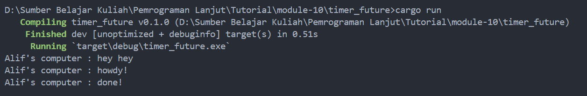
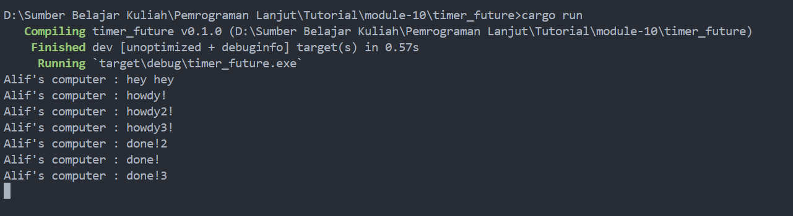

### 1.2 Understanding how it works

Berdasarkan output diatas, terlihat bahwa output "hey hey" diprint terlebih dahulu. Hal ini dikarenakan output "howdy" dan "done" berada di dalam *asynchronus function*. Dimana fungsi asinkronus berjalan di luar fungsi main yang menjalankannya. Karena hal tersebut, "hey hey" diprint terlebih dahulu karena fungsi main akan terus menjalankan programnya. Sementara itu, fungsi asinkronus masih menuggu hasil dari future.

### 1.3 Multiple Spawn and removing drop

Jika terdapat banyak spawn *calls*, maka akan terdapat banyak task yang akan dieksekusi secara asinkronus. Setiap tasks akan ditambahkan pada *executor* *queue* dan akan dieksekusi ketika executor mendapatkan kesempatan untuk menjalankannya. Ketika bagian `drop(spawner)` dihapus, executor akan tetap menunggu task lain untuk di-*spawn*, bahkan setelah semua task yang di-*spawn* telah selesai. Hal ini dikarenakan executor menggunakan *event* *dropping spawner* sebagai sinyal bahwa tidak ada lagi task yang akan di-*spawn*.